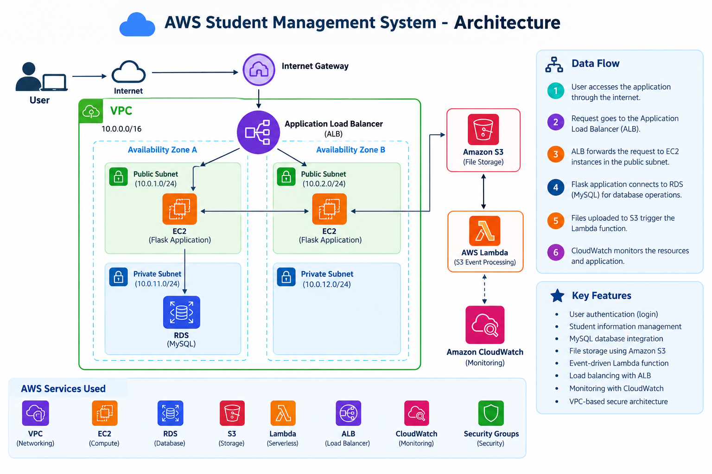

# ☁️ AWS Student Management System

  <b>A cloud-based Student Management System deployed using AWS services</b>

  
  
  
  
  
  

---

## 📌 About the Project

The **AWS Student Management System** is a web-based application developed using **Python Flask** and deployed on **Amazon Web Services (AWS)**.

The application provides a login system and allows users to access and manage student information stored in a **MySQL database hosted on Amazon RDS**.

The project demonstrates the deployment of a web application using multiple AWS services including **VPC, EC2, RDS, S3, Lambda, Application Load Balancer, and CloudWatch**.

---

## 🏗️ Architecture

The following architecture demonstrates the AWS infrastructure used to deploy the Student Management System.

| AWS Service                   | Purpose                                                        |
| ----------------------------- | -------------------------------------------------------------- |
| **Amazon VPC**                | Creates an isolated network environment                        |
| **Amazon EC2**                | Hosts the Flask web application                                |
| **Amazon RDS**                | Hosts the MySQL database                                       |
| **Application Load Balancer** | Receives and distributes application traffic                   |
| **Amazon S3**                 | Stores uploaded files/images                                   |
| **AWS Lambda**                | Performs event-driven processing when files are uploaded to S3 |
| **Amazon CloudWatch**         | Monitors AWS resources and application infrastructure          |
| **Security Groups**           | Controls inbound and outbound network traffic                  |

✨ Features
🔐 User login authentication
👨‍🎓 Student information management
🗄️ MySQL database integration
☁️ AWS cloud deployment
📦 File storage using Amazon S3
⚡ Event-driven Lambda function
⚖️ Application Load Balancer
📊 CloudWatch monitoring
🔒 Network security using Security Groups
🌐 VPC-based AWS infrastructure

🛠️ Technologies
Application

     

Database

  

Cloud

       

Application Workflow

1️⃣ User opens the application
              ↓
2️⃣ Application Load Balancer receives the request
              ↓
3️⃣ ALB forwards request to EC2
              ↓
4️⃣ Flask application processes the request
              ↓
5️⃣ Application connects to RDS MySQL
              ↓
6️⃣ Login / student data is retrieved
              ↓
7️⃣ Response is displayed to the user

## 🗄️ Database

The application uses **MySQL hosted on Amazon RDS**.

### Users Table

Used to store user authentication information.

users
├── id
├── username
└── password
students
├── student details
└── academic / personal information

🔐 Security

The project uses AWS security features to control communication between different components.

VPC provides network isolation
Security Groups control inbound and outbound traffic
EC2 is used to host the application
RDS is separated from direct public access
Application traffic is routed through the Load Balancer

## 📂 Project Structure
AWS-Student-Management-System/
│
├── application/
│   ├── app.py
│   │
│   ├── templates/
│   │   ├── login.html
│   │   └── students.html
│   │
│   └── static/
│       ├── css/
│       ├── js/
│       └── images/
│
├── screenshots/
│   ├── login.png
│   ├── student-details.png
│   ├── ec2.png
│   ├── rds.png
│   ├── s3.png
│   ├── lambda.png
│   ├── alb.png
│   └── cloudwatch.png
│
├── requirements.txt
│
├── .gitignore
│
└── README.md

## ⚙️ Deployment Overview

The application was deployed using the following process:

                AWS VPC
                  │
        ┌─────────┴─────────┐
        │                   │
 Public Subnet         Private Subnet
        │                   │
        ▼                   ▼
 Application              RDS
 Load Balancer           MySQL
        │
        ▼
       EC2
        │
        ▼
   Flask Application
   
   
## 🧪 Testing

The application was tested by:

Accessing the application through the Application Load Balancer
Testing the login functionality
Checking student information
Verifying database connectivity
Testing S3 file uploads
Verifying Lambda execution
Monitoring AWS resources using CloudWatch

## 📚 What I Learned

Through this project, I gained practical experience in:

Deploying web applications on AWS
Configuring AWS VPC networking
Working with EC2
Connecting applications to RDS MySQL
Using S3 for file storage
Creating event-driven Lambda functions
Configuring an Application Load Balancer
Using Security Groups
Monitoring infrastructure with CloudWatch
Working with Linux commands and server environments

## 🎯 Project Outcome

The project successfully demonstrates how a web application can be deployed using AWS cloud infrastructure while integrating compute, database, storage, networking, serverless processing, load balancing, and monitoring services.

👨‍💻 Author

Soorya S Raj

B.Tech Computer Science Engineering
